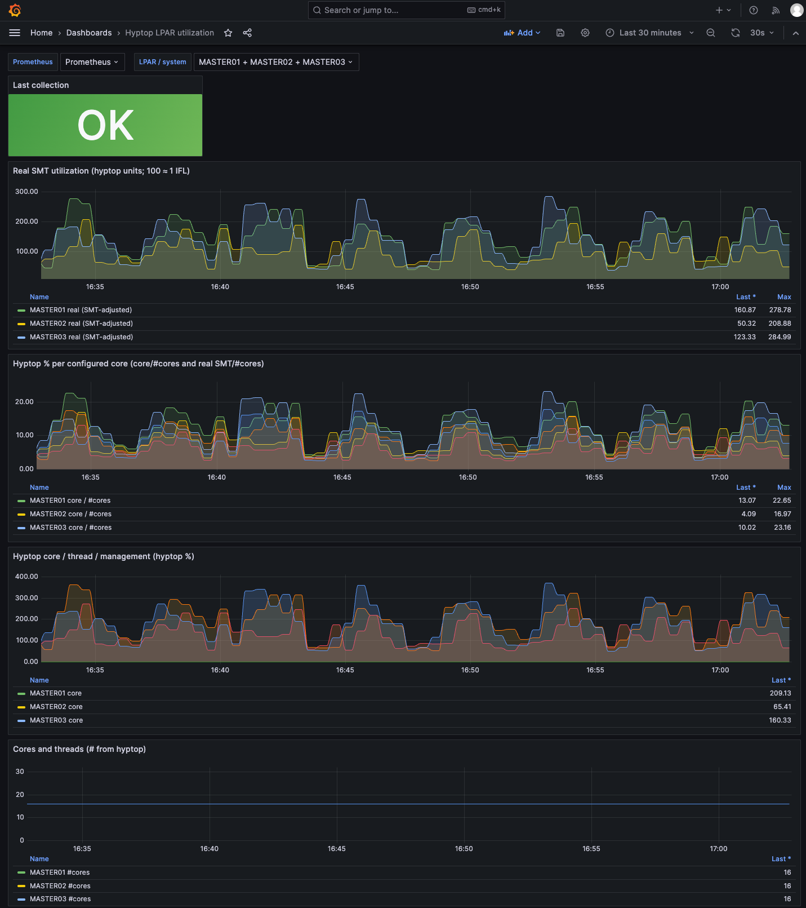

# hyptop-dashboard

On IBM Z and LinuxONE, compute capacity is often oversubscribed. This repo ships a **Prometheus exporter** that runs on **Linux in an LPAR or a z/VM guest**, periodically runs [hyptop](https://www.ibm.com/docs/en/linux-on-systems?topic=c-hyptop), computes **SMT-adjusted “real” utilization** using the [SMT utilization](https://linux.mainframe.blog/smt_utilization/) formula where separate thread/core figures exist (LPAR; see below for z/VM), and exposes **Prometheus** metrics over HTTP for **Grafana** dashboards.

## Requirements

- Linux with `hyptop` installed (LPAR or z/VM guest) and permission to read the relevant **debugfs** hyptop data (see IBM hyptop documentation).
- Python **3.9+** and `prometheus-client`.
- Network path from **Prometheus** to the LPAR (or collector host) on the exporter listen port.

## SMT-adjusted utilization

Using hyptop’s **core** (`u_c`), **thread** (`u_t`), and **management** (`u_m`) values in hyptop’s **%** display (same scale as IBM examples; **100 ≈ one IFL** for that component), and a configurable SMT speedup **s** (default **1.3**, a z15 rule of thumb from the blog):

u_r = \frac{2u_c - u_t}{s} + (u_t - u_c) + u_m

Reference: [SMT: What utilization in real?](https://linux.mainframe.blog/smt_utilization/)

On **z/VM**, hyptop `sys_list` has only aggregate **cpu** and **mgm** for guests (no separate **thread** column in the default field set). The exporter duplicates **cpu%** for the thread gauge and sets **#threads = #cpu**; the “real SMT” series then reduces to the **single-thread case** \(u_r = u_c/s + u_m\) because \(u_t = u_c\).

## Install

From the repository root (use a venv on the LPAR):

```bash
mkdir /opt/hyptop-dashboard
cd /opt/hyptop-dashboard/
git clone https://github.com/aarenw/hyptop-dashboard.git .
python3 -m venv /opt/hyptop-dashboard/.venv
/opt/hyptop-dashboard/.venv/bin/pip install --upgrade pip
/opt/hyptop-dashboard/.venv/bin/pip install .
```

If `pip` copies the tree to a temp dir and fails on `.git`, use in-tree build:

```bash
/opt/hyptop-dashboard/.venv/bin/pip install --use-feature=in-tree-build .
```

Alternatively, without installing the package:

```bash
export PYTHONPATH=/path/to/hyptop-dashboard/src
python3 -m hyptop_dashboard --help
```

## Run the exporter

Use **`--hypervisor lpar`** (default) or **`--hypervisor zvm`**. The exporter runs `hyptop -b` with the IBM **sys_list** field set for that environment:

| `--hypervisor` | hyptop `-f` value        | IBM fields |
|----------------|--------------------------|------------|
| `lpar`         | `#,T,c,e,m,C,E,M,o`      | [LPAR fields](https://www.ibm.com/docs/en/linux-on-systems?topic=fu-lpar-fields) |
| `zvm`          | `#,c,m,C,M,o`            | [z/VM fields](https://www.ibm.com/docs/en/linux-on-systems?topic=fu-zvm-fields) |

It does **not** pass `hyptop -t`; CPU dispatch types use hyptop’s default (see [CPU types](https://www.ibm.com/docs/en/linux-on-systems?topic=h-cpu-types) for interactive changes).

**LPAR example**

```bash
hyptop-exporter \
  --hypervisor lpar \
  --listen-host 0.0.0.0 \
  --listen-port 9105 \
  --interval-seconds 15 \
  --hyptop-binary /usr/sbin/hyptop \
  --hyptop-delay 1 \
  --smt-speedup 1.3
```

**z/VM guest example**

```bash
hyptop-exporter \
  --hypervisor zvm \
  --listen-host 0.0.0.0 \
  --listen-port 9105 \
  --interval-seconds 15 \
  --hyptop-binary /usr/sbin/hyptop \
  --hyptop-delay 1 \
  --smt-speedup 1.3
```


| Flag                              | Meaning                                      |
| --------------------------------- | -------------------------------------------- |
| `--hypervisor`                    | `lpar` (default) or `zvm`                    |
| `--listen-host` / `--listen-port` | HTTP bind address for `/metrics`             |
| `--interval-seconds`              | Sleep between `hyptop` runs                  |
| `--hyptop-binary`                 | Path to `hyptop`                             |
| `--hyptop-delay`                  | Passed to `hyptop -d`                        |
| `--hyptop-timeout`                | Subprocess timeout per `hyptop` invocation   |
| `--smt-speedup`                   | **s** in the formula above                   |
| `-v`                              | Verbose logging                              |


**Scrape interval:** Set Prometheus `scrape_interval` to **at least** `--interval-seconds` (or accept that samples may repeat between hyptop runs).

## systemd

Example unit: [deploy/hyptop-exporter.service](deploy/hyptop-exporter.service). Adjust `User=`, paths, and flags for your site.

```bash
sudo cp deploy/hyptop-exporter.service /etc/systemd/system/hyptop-exporter.service
sudo systemctl daemon-reload
sudo systemctl enable --now hyptop-exporter
sudo systemctl status hyptop-exporter
```

**Firewall:** Allow Prometheus (or your scrapers) to reach `LISTEN_PORT` (default **9105**) on the LPAR.

```bash
# Add a permanent rule (--permanent survives reboot)
sudo firewall-cmd --permanent --add-port=9105/tcp

# Reload firewalld (applies new rules without dropping existing connections)
sudo firewall-cmd --reload

# Verify the port is open
sudo firewall-cmd --list-ports
```

## Prometheus

```yaml
scrape_configs:
  - job_name: hyptop
    scrape_interval: 15s
    static_configs:
      - targets: ["lpar-host.example.com:9105"]
```

## Grafana

Import [grafana/hyptop-lpar.json](grafana/hyptop-lpar.json): **Dashboards → New → Import → Upload JSON**. Choose your Prometheus datasource when prompted.

Example **Hyptop LPAR utilization** dashboard after import and datasource selection (Real SMT, hyptop % per core, core/thread/mgm, core/thread counts, and collection status):



## OpenShift (Prometheus + Grafana)

To run a self-managed **Prometheus** and **Grafana** stack on OpenShift using Red Hat container images (without Cluster Observability Operator), expose the UIs via **Route**, and use the default StorageClass for PVCs, see [docs/openshift-prometheus-grafana-hyptop.md](docs/openshift-prometheus-grafana-hyptop.md). Manifests: [Openshift/prometheus-grafana-stack.yaml](Openshift/prometheus-grafana-stack.yaml); example Service pointing at the hyptop exporter: [Openshift/hyptopsrv.yaml](Openshift/hyptopsrv.yaml).

## Metrics


| Metric                                              | Labels   | Description                                  |
| --------------------------------------------------- | -------- | -------------------------------------------- |
| `hyptop_lpar_core_utilization_hyptop_percent`       | `system` | Core (LPAR) or cpu (z/VM); hyptop % units    |
| `hyptop_lpar_thread_utilization_hyptop_percent`     | `system` | Thread (LPAR); on z/VM same as core cpu%     |
| `hyptop_lpar_management_utilization_hyptop_percent` | `system` | Management time (hyptop % units)             |
| `hyptop_lpar_real_smt_utilization_hyptop_percent`   | `system` | SMT-adjusted; on z/VM degenerate (see above) |
| `hyptop_lpar_core_per_num_cores_hyptop_percent`     | `system` | Core hyptop % divided by `#core` (z/VM: `#cpu`) |
| `hyptop_lpar_real_smt_per_num_cores_hyptop_percent` | `system` | SMT-adjusted hyptop % divided by `#core` (`u_r` / `#core`) |
| `hyptop_lpar_num_cores`                             | `system` | LPAR `#core`; z/VM `#cpu`                    |
| `hyptop_lpar_num_threads`                           | `system` | LPAR `#The`; z/VM equals `#cpu`              |
| `hyptop_exporter_collection_success`                | —        | `1` if last `hyptop` run and parse succeeded |
| `hyptop_exporter_last_success_timestamp_seconds`    | —        | Unix time of last successful collection      |


Time series for systems that disappear from hyptop output are removed on the next successful scrape. Label **`system`** is the LPAR name or z/VM **guest id**.

## Hyptop references

- [hyptop command](https://www.ibm.com/docs/en/linux-on-systems?topic=commands-hyptop)
- [LPAR fields](https://www.ibm.com/docs/en/linux-on-systems?topic=fu-lpar-fields)
- [z/VM fields](https://www.ibm.com/docs/en/linux-on-systems?topic=fu-zvm-fields)
- [Units](https://www.ibm.com/docs/en/linux-on-systems?topic=fu-units)
- [CPU types](https://www.ibm.com/docs/en/linux-on-systems?topic=h-cpu-types)
- [Examples](https://www.ibm.com/docs/en/linux-on-systems?topic=h-examples)

## Troubleshooting

- **`hyptop_exporter_collection_success` is 0:** Check journal/logs for `hyptop` errors, permissions on `/s390_hypfs`, and HMC “Global performance data” for other LPARs if needed.
- **No series / empty `system` list:** For LPAR run `hyptop -b -n 1 -f "#,T,c,e,m,C,E,M,o"`; for z/VM run `hyptop -b -n 1 -f "#,c,m,C,M,o"` — output must match `--hypervisor`.
- **Values look wrong:** Tune `--smt-speedup` (**s**) for your hardware and workload; the blog notes **s** is workload-dependent. CPU-type filtering must be done in hyptop itself (the exporter does not pass `-t`).

## Development

```bash
pip install -e ".[dev]"   # or: pip install pytest && PYTHONPATH=src pytest
pytest
```

## Requirements traceability

1. **Script:** Periodically run hyptop, compute utilization, expose HTTP metrics for Prometheus (`hyptop-exporter` / `python -m hyptop_dashboard`).
2. **systemd:** [deploy/hyptop-exporter.service](deploy/hyptop-exporter.service) and the install/run sections above.
3. **Grafana:** [grafana/hyptop-lpar.json](grafana/hyptop-lpar.json).
4. **README:** This document (original “update README tonight” intent folded into the maintained guide above).
